# TeoriPro ERD

> Generated by [`prisma-markdown`](https://github.com/samchon/prisma-markdown)

- [default](#default)

## default

```mermaid
erDiagram
"User" {
  String id PK
  String email UK
  String passwordHash "nullable"
  Role role
  DateTime emailVerifiedAt "nullable"
  String totpSecret "nullable"
  Boolean isActive
  DateTime createdAt
  DateTime updatedAt
  DateTime deletedAt "nullable"
}
"Profile" {
  String id PK
  String userId FK,UK
  String firstName
  String lastName
  String phone "nullable"
  Locale preferredLocale
  QuizMode preferredQuizMode
  String avatarUrl "nullable"
  String instructorNote "nullable"
  DateTime createdAt
  DateTime updatedAt
}
"StudentGroup" {
  String id PK
  String name
  String description "nullable"
  String createdById FK
  DateTime createdAt
  DateTime updatedAt
  DateTime deletedAt "nullable"
}
"GroupMembership" {
  String id PK
  String groupId FK
  String userId FK
  DateTime joinedAt
}
"InviteLink" {
  String id PK
  String token UK
  Role role
  String groupId FK "nullable"
  Int maxUses "nullable"
  Int usedCount
  DateTime expiresAt "nullable"
  String createdById FK
  DateTime createdAt
  DateTime revokedAt "nullable"
}
"LicenseClass" {
  String id PK
  String code UK
  Json name
  Int questionCount
  Int timeLimitMin
  Int passMark
  Boolean isEnabled
  Int sortOrder
  DateTime createdAt
  DateTime updatedAt
}
"Topic" {
  String id PK
  String slug UK
  String parentId FK "nullable"
  Json name
  Json description "nullable"
  Int sortOrder
  Boolean isActive
  DateTime createdAt
  DateTime updatedAt
  DateTime deletedAt "nullable"
}
"Sign" {
  String id PK
  String code UK
  SignClass signClass
  String svgPath
  Json name
  Json meaning
  Boolean isActive
  DateTime createdAt
  DateTime updatedAt
}
"MasterItem" {
  String id PK
  ItemType type
  ItemStatus status
  String topicId FK
  String licenseClassId FK "nullable"
  Int difficulty
  Json content
  Json parameterSlots "nullable"
  Json legalCitations
  Int version
  Provenance createdBy
  String modelVersion "nullable"
  String promptVersion "nullable"
  String sourceImageId FK "nullable"
  String createdById FK "nullable"
  String reviewedById FK "nullable"
  DateTime reviewedAt "nullable"
  String reviewNote "nullable"
  DateTime createdAt
  DateTime updatedAt
  DateTime deletedAt "nullable"
}
"MasterItemCitation" {
  String id PK
  String masterItemId FK
  CitationType citationType
  String kbChunkId FK "nullable"
  String factKey FK "nullable"
  String quote "nullable"
  DateTime createdAt
}
"ItemVariant" {
  String id PK
  String masterItemId FK
  Int masterVersion
  String contentHash UK
  Json content
  String correctOptionKey
  Json explanation
  VariantSource source
  Json validatorReport "nullable"
  String modelVersion "nullable"
  String promptVersion "nullable"
  Boolean isActive
  DateTime createdAt
  DateTime updatedAt
}
"ImageAsset" {
  String id PK
  String url
  String storagePath
  ImageStatus status
  String perceptualHash "nullable"
  Int width "nullable"
  Int height "nullable"
  Boolean exifStripped
  Boolean blurApplied
  Json aiContextSheet "nullable"
  DateTime contextVerifiedAt "nullable"
  Json licenseAttestation "nullable"
  String uploadedById FK "nullable"
  DateTime createdAt
  DateTime updatedAt
  DateTime deletedAt "nullable"
}
"ImageDetection" {
  String id PK
  String imageAssetId FK
  String signCode FK "nullable"
  String label "nullable"
  Json bbox
  Float confidence
  Boolean humanVerified
  DateTime createdAt
  DateTime updatedAt
}
"ExamBlueprint" {
  String id PK
  String licenseClassId FK
  Json name "nullable"
  Json topicDistribution
  Float imageRatio
  Boolean isDefault
  Boolean isActive
  DateTime createdAt
  DateTime updatedAt
}
"ExamAttempt" {
  String id PK
  String userId FK
  AttemptMode mode
  AttemptStatus status
  String licenseClassId FK "nullable"
  String blueprintId FK "nullable"
  String seed
  Int questionCountSnapshot
  Int timeLimitSecSnapshot "nullable"
  Int passMarkSnapshot "nullable"
  DateTime startedAt
  DateTime expiresAt "nullable"
  DateTime submittedAt "nullable"
  Int correctCount "nullable"
  Boolean passed "nullable"
  Json topicBreakdown "nullable"
  Int focusLossCount
  Boolean anomalyFlagged
  DateTime createdAt
  DateTime updatedAt
}
"ExamAttemptQuestion" {
  String id PK
  String attemptId FK
  String variantId FK
  Int position
  String topicId FK
  Json optionOrder
  String answeredOptionKey "nullable"
  Boolean isCorrect "nullable"
  Boolean flagged
  DateTime answeredAt "nullable"
  Int timeSpentMs "nullable"
  DateTime createdAt
  DateTime updatedAt
}
"TopicMastery" {
  String id PK
  String userId FK
  String topicId FK
  Int totalAnswered
  Int totalCorrect
  Float rollingScore
  Json recentOutcomes "nullable"
  DateTime lastAnsweredAt "nullable"
  DateTime createdAt
  DateTime updatedAt
}
"ReadinessSnapshot" {
  String id PK
  String userId FK
  Float score
  Json breakdown
  DateTime createdAt
}
"MistakeCard" {
  String id PK
  String userId FK
  String masterItemId FK
  Float easeFactor
  Float intervalDays
  Int repetitions
  Int lapses
  DateTime dueAt
  Boolean suspended
  DateTime lastReviewedAt "nullable"
  DateTime createdAt
  DateTime updatedAt
}
"HomeworkAssignment" {
  String id PK
  String createdById FK
  String groupId FK "nullable"
  String userId "nullable"
  String title
  String description "nullable"
  Json config
  DateTime deadline
  DateTime createdAt
  DateTime updatedAt
  DateTime deletedAt "nullable"
}
"HomeworkCompletion" {
  String id PK
  String assignmentId FK
  String userId FK
  String attemptId FK "nullable"
  DateTime completedAt
}
"KbSource" {
  String id PK
  String code UK
  KbSourceKind kind
  String name
  String url "nullable"
  DateTime effectiveDate "nullable"
  String version "nullable"
  DateTime lastIngestedAt "nullable"
  DateTime createdAt
  DateTime updatedAt
  DateTime deletedAt "nullable"
}
"KbChunk" {
  String id PK
  String sourceId FK
  String ref
  String text
  Int tokenCount "nullable"
  Boolean isActive
  DateTime createdAt
  DateTime updatedAt
}
"Fact" {
  String key PK
  String value
  FactType valueType
  String unit "nullable"
  String description "nullable"
  Json sourceRef
  DateTime effectiveFrom "nullable"
  DateTime createdAt
  DateTime updatedAt
}
"Setting" {
  String key PK
  Json value
  String updatedById FK "nullable"
  DateTime createdAt
  DateTime updatedAt
}
"AuditLog" {
  String id PK
  String actorId FK "nullable"
  String action
  String entityType "nullable"
  String entityId "nullable"
  Json meta "nullable"
  String ip "nullable"
  String userAgent "nullable"
  DateTime createdAt
}
"Profile" |o--|| "User" : user
"StudentGroup" }o--|| "User" : createdBy
"GroupMembership" }o--|| "StudentGroup" : group
"GroupMembership" }o--|| "User" : user
"InviteLink" }o--o| "StudentGroup" : group
"InviteLink" }o--|| "User" : createdBy
"Topic" }o--o| "Topic" : parent
"MasterItem" }o--|| "Topic" : topic
"MasterItem" }o--o| "LicenseClass" : licenseClass
"MasterItem" }o--o| "ImageAsset" : sourceImage
"MasterItem" }o--o| "User" : createdByUser
"MasterItem" }o--o| "User" : reviewedBy
"MasterItemCitation" }o--|| "MasterItem" : masterItem
"MasterItemCitation" }o--o| "KbChunk" : kbChunk
"MasterItemCitation" }o--o| "Fact" : fact
"ItemVariant" }o--|| "MasterItem" : masterItem
"ImageAsset" }o--o| "User" : uploadedBy
"ImageDetection" }o--|| "ImageAsset" : imageAsset
"ImageDetection" }o--o| "Sign" : sign
"ExamBlueprint" }o--|| "LicenseClass" : licenseClass
"ExamAttempt" }o--|| "User" : user
"ExamAttempt" }o--o| "LicenseClass" : licenseClass
"ExamAttempt" }o--o| "ExamBlueprint" : blueprint
"ExamAttemptQuestion" }o--|| "ExamAttempt" : attempt
"ExamAttemptQuestion" }o--|| "ItemVariant" : variant
"ExamAttemptQuestion" }o--|| "Topic" : topic
"TopicMastery" }o--|| "User" : user
"TopicMastery" }o--|| "Topic" : topic
"ReadinessSnapshot" }o--|| "User" : user
"MistakeCard" }o--|| "User" : user
"MistakeCard" }o--|| "MasterItem" : masterItem
"HomeworkAssignment" }o--|| "User" : createdBy
"HomeworkAssignment" }o--o| "StudentGroup" : group
"HomeworkCompletion" }o--|| "HomeworkAssignment" : assignment
"HomeworkCompletion" }o--o| "ExamAttempt" : attempt
"HomeworkCompletion" }o--|| "User" : user
"KbChunk" }o--|| "KbSource" : source
"Setting" }o--o| "User" : updatedBy
"AuditLog" }o--o| "User" : actor
```

### `User`

Properties as follows:

- `id`:
- `email`:
- `passwordHash`:
- `role`:
- `emailVerifiedAt`:
- `totpSecret`:
- `isActive`:
- `createdAt`:
- `updatedAt`:
- `deletedAt`:

### `Profile`

Properties as follows:

- `id`:
- `userId`:
- `firstName`:
- `lastName`:
- `phone`:
- `preferredLocale`:
- `preferredQuizMode`:
- `avatarUrl`:
- `instructorNote`:
- `createdAt`:
- `updatedAt`:

### `StudentGroup`

Properties as follows:

- `id`:
- `name`:
- `description`:
- `createdById`:
- `createdAt`:
- `updatedAt`:
- `deletedAt`:

### `GroupMembership`

Properties as follows:

- `id`:
- `groupId`:
- `userId`:
- `joinedAt`:

### `InviteLink`

Properties as follows:

- `id`:
- `token`:
- `role`:
- `groupId`:
- `maxUses`:
- `usedCount`:
- `expiresAt`:
- `createdById`:
- `createdAt`:
- `revokedAt`:

### `LicenseClass`

Properties as follows:

- `id`:
- `code`:
- `name`:
- `questionCount`:
- `timeLimitMin`:
- `passMark`:
- `isEnabled`:
- `sortOrder`:
- `createdAt`:
- `updatedAt`:

### `Topic`

Properties as follows:

- `id`:
- `slug`:
- `parentId`:
- `name`:
- `description`:
- `sortOrder`:
- `isActive`:
- `createdAt`:
- `updatedAt`:
- `deletedAt`:

### `Sign`

Properties as follows:

- `id`:
- `code`:
- `signClass`:
- `svgPath`:
- `name`:
- `meaning`:
- `isActive`:
- `createdAt`:
- `updatedAt`:

### `MasterItem`

Properties as follows:

- `id`:
- `type`:
- `status`:
- `topicId`:
- `licenseClassId`:
- `difficulty`:
- `content`:
- `parameterSlots`:
- `legalCitations`:
- `version`:
- `createdBy`:
- `modelVersion`:
- `promptVersion`:
- `sourceImageId`:
- `createdById`:
- `reviewedById`:
- `reviewedAt`:
- `reviewNote`:
- `createdAt`:
- `updatedAt`:
- `deletedAt`:

### `MasterItemCitation`

Properties as follows:

- `id`:
- `masterItemId`:
- `citationType`:
- `kbChunkId`:
- `factKey`:
- `quote`:
- `createdAt`:

### `ItemVariant`

Properties as follows:

- `id`:
- `masterItemId`:
- `masterVersion`:
- `contentHash`:
- `content`:
- `correctOptionKey`:
- `explanation`:
- `source`:
- `validatorReport`:
- `modelVersion`:
- `promptVersion`:
- `isActive`:
- `createdAt`:
- `updatedAt`:

### `ImageAsset`

Properties as follows:

- `id`:
- `url`:
- `storagePath`:
- `status`:
- `perceptualHash`:
- `width`:
- `height`:
- `exifStripped`:
- `blurApplied`:
- `aiContextSheet`:
- `contextVerifiedAt`:
- `licenseAttestation`:
- `uploadedById`:
- `createdAt`:
- `updatedAt`:
- `deletedAt`:

### `ImageDetection`

Properties as follows:

- `id`:
- `imageAssetId`:
- `signCode`:
- `label`:
- `bbox`:
- `confidence`:
- `humanVerified`:
- `createdAt`:
- `updatedAt`:

### `ExamBlueprint`

Properties as follows:

- `id`:
- `licenseClassId`:
- `name`:
- `topicDistribution`:
- `imageRatio`:
- `isDefault`:
- `isActive`:
- `createdAt`:
- `updatedAt`:

### `ExamAttempt`

Properties as follows:

- `id`:
- `userId`:
- `mode`:
- `status`:
- `licenseClassId`:
- `blueprintId`:
- `seed`:
- `questionCountSnapshot`:
- `timeLimitSecSnapshot`:
- `passMarkSnapshot`:
- `startedAt`:
- `expiresAt`:
- `submittedAt`:
- `correctCount`:
- `passed`:
- `topicBreakdown`:
- `focusLossCount`:
- `anomalyFlagged`:
- `createdAt`:
- `updatedAt`:

### `ExamAttemptQuestion`

Properties as follows:

- `id`:
- `attemptId`:
- `variantId`:
- `position`:
- `topicId`:
- `optionOrder`:
- `answeredOptionKey`:
- `isCorrect`:
- `flagged`:
- `answeredAt`:
- `timeSpentMs`:
- `createdAt`:
- `updatedAt`:

### `TopicMastery`

Properties as follows:

- `id`:
- `userId`:
- `topicId`:
- `totalAnswered`:
- `totalCorrect`:
- `rollingScore`:
- `recentOutcomes`:
- `lastAnsweredAt`:
- `createdAt`:
- `updatedAt`:

### `ReadinessSnapshot`

Properties as follows:

- `id`:
- `userId`:
- `score`:
- `breakdown`:
- `createdAt`:

### `MistakeCard`

Properties as follows:

- `id`:
- `userId`:
- `masterItemId`:
- `easeFactor`:
- `intervalDays`:
- `repetitions`:
- `lapses`:
- `dueAt`:
- `suspended`:
- `lastReviewedAt`:
- `createdAt`:
- `updatedAt`:

### `HomeworkAssignment`

Properties as follows:

- `id`:
- `createdById`:
- `groupId`:
- `userId`:
- `title`:
- `description`:
- `config`:
- `deadline`:
- `createdAt`:
- `updatedAt`:
- `deletedAt`:

### `HomeworkCompletion`

Properties as follows:

- `id`:
- `assignmentId`:
- `userId`:
- `attemptId`:
- `completedAt`:

### `KbSource`

Properties as follows:

- `id`:
- `code`:
- `kind`:
- `name`:
- `url`:
- `effectiveDate`:
- `version`:
- `lastIngestedAt`:
- `createdAt`:
- `updatedAt`:
- `deletedAt`:

### `KbChunk`

Properties as follows:

- `id`:
- `sourceId`:
- `ref`:
- `text`:
- `tokenCount`:
- `isActive`:
- `createdAt`:
- `updatedAt`:

### `Fact`

Properties as follows:

- `key`:
- `value`:
- `valueType`:
- `unit`:
- `description`:
- `sourceRef`:
- `effectiveFrom`:
- `createdAt`:
- `updatedAt`:

### `Setting`

Properties as follows:

- `key`:
- `value`:
- `updatedById`:
- `createdAt`:
- `updatedAt`:

### `AuditLog`

Properties as follows:

- `id`:
- `actorId`:
- `action`:
- `entityType`:
- `entityId`:
- `meta`:
- `ip`:
- `userAgent`:
- `createdAt`:
