# TeoriPro ERD

> Generated by [`prisma-markdown`](https://github.com/samchon/prisma-markdown)

- [default](#default)

## default

```mermaid
erDiagram
"User" {
  String id PK
  String email UK
  String passwordHash "nullable"
  Role role
  DateTime emailVerifiedAt "nullable"
  String totpSecret "nullable"
  Boolean isActive
  DateTime createdAt
  DateTime updatedAt
  DateTime deletedAt "nullable"
}
"Profile" {
  String id PK
  String userId FK,UK
  String firstName
  String lastName
  String phone "nullable"
  String preferredLocale
  QuizMode preferredQuizMode
  String avatarUrl "nullable"
  String instructorNote "nullable"
  DateTime createdAt
  DateTime updatedAt
}
"StudentGroup" {
  String id PK
  String name
  String description "nullable"
  String createdById FK
  DateTime createdAt
  DateTime updatedAt
  DateTime deletedAt "nullable"
}
"GroupMembership" {
  String id PK
  String groupId FK
  String userId FK
  DateTime joinedAt
}
"InviteLink" {
  String id PK
  String token UK
  Role role
  String groupId FK "nullable"
  String email "nullable"
  Int maxUses "nullable"
  Int usedCount
  DateTime expiresAt "nullable"
  String createdById FK
  DateTime createdAt
  DateTime revokedAt "nullable"
}
"UserSession" {
  String id PK
  String userId FK
  String userAgent "nullable"
  String ip "nullable"
  DateTime createdAt
  DateTime lastSeenAt
  DateTime revokedAt "nullable"
}
"AuthToken" {
  String id PK
  String tokenHash UK
  AuthTokenType type
  String userId FK
  DateTime expiresAt
  DateTime consumedAt "nullable"
  DateTime createdAt
}
"LicenseClass" {
  String id PK
  String code UK
  Json name
  Int questionCount
  Int timeLimitMin
  Int passMark
  Boolean isEnabled
  Int sortOrder
  DateTime createdAt
  DateTime updatedAt
}
"Topic" {
  String id PK
  String slug UK
  String parentId FK "nullable"
  Json name
  Json description "nullable"
  Int sortOrder
  Boolean isActive
  DateTime createdAt
  DateTime updatedAt
  DateTime deletedAt "nullable"
}
"Sign" {
  String id PK
  String code UK
  SignClass signClass
  String svgPath
  Json name
  Json meaning
  Boolean isActive
  Boolean provisional
  String sourceNote "nullable"
  DateTime createdAt
  DateTime updatedAt
}
"MasterItem" {
  String id PK
  ItemType type
  ItemStatus status
  String topicId FK
  String licenseClassId FK "nullable"
  Int difficulty
  Json content
  String correctOptionKey "nullable"
  Json parameterSlots "nullable"
  Json legalCitations
  Int version
  Provenance createdBy
  String modelVersion "nullable"
  String promptVersion "nullable"
  String sourceImageId FK "nullable"
  String createdById FK "nullable"
  String reviewedById FK "nullable"
  DateTime reviewedAt "nullable"
  String reviewNote "nullable"
  RejectionReason reviewReason "nullable"
  String batchId FK "nullable"
  String replacesId FK "nullable"
  String conceptGroupId "nullable"
  DateTime createdAt
  DateTime updatedAt
  DateTime deletedAt "nullable"
}
"ItemApproval" {
  String id PK
  String masterItemId FK
  String approverId FK
  Int itemVersion
  String note "nullable"
  DateTime createdAt
}
"GenerationBatch" {
  String id PK
  BatchKind kind
  BatchStatus status
  String sourceImageId FK "nullable"
  String topicId FK "nullable"
  String licenseClassId "nullable"
  Int requestedCount
  Boolean factsVerified
  String providerId "nullable"
  String modelVersion "nullable"
  String promptVersion "nullable"
  String notes "nullable"
  String createdById FK "nullable"
  DateTime createdAt
  DateTime updatedAt
}
"GenerationRejection" {
  String id PK
  RejectionSource source
  String masterItemId FK "nullable"
  String batchId FK "nullable"
  String topicId FK "nullable"
  String stemEn
  String stemNb "nullable"
  String reasonCodes
  String note "nullable"
  String modelVersion "nullable"
  String promptVersion "nullable"
  String createdById "nullable"
  DateTime createdAt
}
"MasterItemCitation" {
  String id PK
  String masterItemId FK
  CitationType citationType
  String kbChunkId FK "nullable"
  String factKey FK "nullable"
  String quote "nullable"
  DateTime createdAt
}
"ItemVariant" {
  String id PK
  String masterItemId FK
  Int masterVersion
  String contentHash UK
  Json content
  String correctOptionKey
  Json explanation
  VariantSource source
  Json validatorReport "nullable"
  String modelVersion "nullable"
  String promptVersion "nullable"
  Boolean isActive
  DateTime createdAt
  DateTime updatedAt
}
"ImageAsset" {
  String id PK
  String url
  String storagePath
  ImageStatus status
  String perceptualHash "nullable"
  Int width "nullable"
  Int height "nullable"
  Boolean exifStripped
  Boolean blurApplied
  Json aiContextSheet "nullable"
  DateTime contextVerifiedAt "nullable"
  Json licenseAttestation "nullable"
  String uploadedById FK "nullable"
  DateTime createdAt
  DateTime updatedAt
  DateTime deletedAt "nullable"
}
"ImageDetection" {
  String id PK
  String imageAssetId FK
  String signCode FK "nullable"
  String label "nullable"
  Json bbox
  Float confidence
  Boolean humanVerified
  DateTime createdAt
  DateTime updatedAt
}
"ExamBlueprint" {
  String id PK
  String licenseClassId FK
  Json name "nullable"
  Json topicDistribution
  Float imageRatio
  Boolean isDefault
  Boolean isActive
  DateTime createdAt
  DateTime updatedAt
}
"ExamAttempt" {
  String id PK
  String userId FK
  AttemptMode mode
  AttemptStatus status
  String licenseClassId FK "nullable"
  String blueprintId FK "nullable"
  String seed
  String locale
  Int questionCountSnapshot
  Int timeLimitSecSnapshot "nullable"
  Int passMarkSnapshot "nullable"
  DateTime startedAt
  DateTime expiresAt "nullable"
  DateTime submittedAt "nullable"
  Int correctCount "nullable"
  Boolean passed "nullable"
  Json topicBreakdown "nullable"
  String resultHash "nullable"
  DateTime attestedAt "nullable"
  Boolean countsTowardGuarantee
  Json setupSnapshot "nullable"
  String taskSetId FK "nullable"
  Int focusLossCount
  Boolean anomalyFlagged
  DateTime createdAt
  DateTime updatedAt
}
"ExamAttemptQuestion" {
  String id PK
  String attemptId FK
  String variantId FK
  Int position
  String topicId FK
  Json optionOrder
  String answeredOptionKey "nullable"
  Boolean isCorrect "nullable"
  Boolean flagged
  DateTime answeredAt "nullable"
  Int timeSpentMs "nullable"
  DateTime createdAt
  DateTime updatedAt
}
"TaskSet" {
  String id PK
  Int number
  String licenseClassId FK
  TaskSetStatus status
  Int poolSize
  Int paperSize
  Int passMark
  Int timeLimitSec
  Json composition
  String buildId FK "nullable"
  DateTime publishedAt "nullable"
  DateTime createdAt
  DateTime updatedAt
}
"TaskSetMember" {
  String masterItemId PK,FK
  String taskSetId FK
  DateTime createdAt
}
"TaskSetBuild" {
  String id PK
  BatchStatus status
  String providerId "nullable"
  String modelVersion "nullable"
  String promptVersion "nullable"
  Json stats
  Json warnings
  String requestedById FK "nullable"
  DateTime createdAt
  DateTime updatedAt
}
"TaskSetProgress" {
  String userId FK
  String taskSetId FK
  Int attempts
  Int bestCorrect "nullable"
  Int bestOutOf "nullable"
  DateTime passedAt "nullable"
  String lastAttemptId "nullable"
  DateTime lastAttemptAt "nullable"
  DateTime updatedAt
}
"TopicMastery" {
  String id PK
  String userId FK
  String topicId FK
  Int totalAnswered
  Int totalCorrect
  Float rollingScore
  Json recentOutcomes "nullable"
  DateTime lastAnsweredAt "nullable"
  DateTime createdAt
  DateTime updatedAt
}
"ReadinessSnapshot" {
  String id PK
  String userId FK
  Float score
  Json breakdown
  DateTime createdAt
}
"MistakeCard" {
  String id PK
  String userId FK
  String masterItemId FK
  Float easeFactor
  Float intervalDays
  Int repetitions
  Int lapses
  DateTime dueAt
  Boolean suspended
  DateTime lastReviewedAt "nullable"
  DateTime createdAt
  DateTime updatedAt
}
"HomeworkAssignment" {
  String id PK
  String createdById FK
  String groupId FK "nullable"
  String userId "nullable"
  String title
  String description "nullable"
  Json config
  DateTime deadline
  DateTime createdAt
  DateTime updatedAt
  DateTime deletedAt "nullable"
}
"HomeworkCompletion" {
  String id PK
  String assignmentId FK
  String userId FK
  String attemptId FK "nullable"
  DateTime completedAt
}
"KbSource" {
  String id PK
  String code UK
  KbSourceKind kind
  String name
  String url "nullable"
  DateTime effectiveDate "nullable"
  String version "nullable"
  DateTime lastIngestedAt "nullable"
  DateTime createdAt
  DateTime updatedAt
  DateTime deletedAt "nullable"
}
"KbChunk" {
  String id PK
  String sourceId FK
  String ref
  String text
  Int tokenCount "nullable"
  Boolean isActive
  DateTime createdAt
  DateTime updatedAt
}
"Fact" {
  String key PK
  String value
  FactType valueType
  String unit "nullable"
  String description "nullable"
  Json sourceRef
  DateTime effectiveFrom "nullable"
  DateTime createdAt
  DateTime updatedAt
}
"AiProvider" {
  String id PK
  AiProviderKind kind
  String label
  String baseUrl "nullable"
  String encryptedApiKey
  String keyHint
  Boolean isActive
  DateTime lastCheckedAt "nullable"
  Boolean lastCheckOk "nullable"
  String lastCheckError "nullable"
  String createdById FK "nullable"
  DateTime createdAt
  DateTime updatedAt
}
"AiRoute" {
  String id PK
  AiTask task
  String providerId FK
  String model
  Int priority
  Boolean isActive
  DateTime createdAt
  DateTime updatedAt
}
"Setting" {
  String key PK
  Json value
  String updatedById FK "nullable"
  DateTime createdAt
  DateTime updatedAt
}
"AuditLog" {
  String id PK
  String actorId FK "nullable"
  String action
  String entityType "nullable"
  String entityId "nullable"
  Json meta "nullable"
  String ip "nullable"
  String userAgent "nullable"
  DateTime createdAt
}
"Language" {
  String code PK
  String englishName
  String nativeName
  String shortLabel
  String urlPrefix UK
  TextDirection direction
  Boolean isBuiltIn
  Boolean requiresApproval
  Int minApprovers
  Boolean studentVisible
  String fallbackCode
  Int sortOrder
  Float qaSampleRate
  Json glossary "nullable"
  Int glossaryVersion
  String styleNote "nullable"
  DateTime lastSyncedAt "nullable"
  DateTime createdAt
  DateTime updatedAt
}
"Translation" {
  String id PK
  String locale FK
  TranslatableEntity entity
  String entityId
  Json value
  TranslationStatus status
  String sourceHash
  String sourceLocale
  String modelVersion "nullable"
  String promptVersion "nullable"
  String providerLabel "nullable"
  Int promptTokens "nullable"
  Int completionTokens "nullable"
  Boolean fromMemory
  Int repairAttempts
  Json qaReport "nullable"
  Float semanticScore "nullable"
  String qaFlags
  String reviewedById FK "nullable"
  DateTime reviewedAt "nullable"
  String reviewNote "nullable"
  String runId FK "nullable"
  DateTime createdAt
  DateTime updatedAt
}
"TranslationMemory" {
  String id PK
  String locale FK
  String sourceHash
  TranslatableEntity contextKind
  Json value
  Int hits
  String modelVersion "nullable"
  String promptVersion "nullable"
  Int glossaryVersion
  DateTime createdAt
  DateTime lastUsedAt "nullable"
}
"TranslationTerm" {
  String id PK
  String locale
  String source
  String value
  String note "nullable"
  DateTime createdAt
}
"TranslationRun" {
  String id PK
  String locale FK
  TranslationRunKind kind
  TranslationRunStatus status
  Int plannedUnits
  Int translatedUnits
  Int memoryHits
  Int failedUnits
  Int flaggedUnits
  Int promptTokens
  Int completionTokens
  Float estimatedUsd
  DateTime enqueuedAt "nullable"
  DateTime heartbeatAt "nullable"
  Boolean pauseRequested
  Boolean cancelRequested
  Float rateUnitsPerMin "nullable"
  Int modelBatches
  String error "nullable"
  String leaseOwner "nullable"
  DateTime leaseExpiresAt "nullable"
  String startedById FK "nullable"
  DateTime startedAt "nullable"
  DateTime finishedAt "nullable"
  DateTime createdAt
  DateTime updatedAt
}
"TranslationJob" {
  String id PK
  String runId FK
  TranslatableEntity entity
  String entityId
  String sourceHash
  TranslationJobState state
  Int attempts
  String claimedBy "nullable"
  String error "nullable"
  DateTime startedAt "nullable"
  DateTime finishedAt "nullable"
}
"Profile" |o--|| "User" : user
"StudentGroup" }o--|| "User" : createdBy
"GroupMembership" }o--|| "StudentGroup" : group
"GroupMembership" }o--|| "User" : user
"InviteLink" }o--o| "StudentGroup" : group
"InviteLink" }o--|| "User" : createdBy
"UserSession" }o--|| "User" : user
"AuthToken" }o--|| "User" : user
"Topic" }o--o| "Topic" : parent
"MasterItem" }o--|| "Topic" : topic
"MasterItem" }o--o| "LicenseClass" : licenseClass
"MasterItem" }o--o| "ImageAsset" : sourceImage
"MasterItem" }o--o| "GenerationBatch" : batch
"MasterItem" }o--o| "MasterItem" : replaces
"MasterItem" }o--o| "User" : createdByUser
"MasterItem" }o--o| "User" : reviewedBy
"ItemApproval" }o--|| "MasterItem" : masterItem
"ItemApproval" }o--|| "User" : approver
"GenerationBatch" }o--o| "ImageAsset" : sourceImage
"GenerationBatch" }o--o| "Topic" : topic
"GenerationBatch" }o--o| "User" : createdBy
"GenerationRejection" }o--o| "GenerationBatch" : batch
"GenerationRejection" }o--o| "Topic" : topic
"GenerationRejection" }o--o| "MasterItem" : masterItem
"MasterItemCitation" }o--|| "MasterItem" : masterItem
"MasterItemCitation" }o--o| "KbChunk" : kbChunk
"MasterItemCitation" }o--o| "Fact" : fact
"ItemVariant" }o--|| "MasterItem" : masterItem
"ImageAsset" }o--o| "User" : uploadedBy
"ImageDetection" }o--|| "ImageAsset" : imageAsset
"ImageDetection" }o--o| "Sign" : sign
"ExamBlueprint" }o--|| "LicenseClass" : licenseClass
"ExamAttempt" }o--|| "User" : user
"ExamAttempt" }o--o| "LicenseClass" : licenseClass
"ExamAttempt" }o--o| "ExamBlueprint" : blueprint
"ExamAttempt" }o--o| "TaskSet" : taskSet
"ExamAttemptQuestion" }o--|| "ExamAttempt" : attempt
"ExamAttemptQuestion" }o--|| "ItemVariant" : variant
"ExamAttemptQuestion" }o--|| "Topic" : topic
"TaskSet" }o--|| "LicenseClass" : licenseClass
"TaskSet" }o--o| "TaskSetBuild" : build
"TaskSetMember" |o--|| "MasterItem" : masterItem
"TaskSetMember" }o--|| "TaskSet" : taskSet
"TaskSetBuild" }o--o| "User" : requestedBy
"TaskSetProgress" }o--|| "User" : user
"TaskSetProgress" }o--|| "TaskSet" : taskSet
"TopicMastery" }o--|| "User" : user
"TopicMastery" }o--|| "Topic" : topic
"ReadinessSnapshot" }o--|| "User" : user
"MistakeCard" }o--|| "User" : user
"MistakeCard" }o--|| "MasterItem" : masterItem
"HomeworkAssignment" }o--|| "User" : createdBy
"HomeworkAssignment" }o--o| "StudentGroup" : group
"HomeworkCompletion" }o--|| "HomeworkAssignment" : assignment
"HomeworkCompletion" }o--o| "ExamAttempt" : attempt
"HomeworkCompletion" }o--|| "User" : user
"KbChunk" }o--|| "KbSource" : source
"AiProvider" }o--o| "User" : createdBy
"AiRoute" }o--|| "AiProvider" : provider
"Setting" }o--o| "User" : updatedBy
"AuditLog" }o--o| "User" : actor
"Translation" }o--|| "Language" : language
"Translation" }o--o| "User" : reviewedBy
"Translation" }o--o| "TranslationRun" : run
"TranslationMemory" }o--|| "Language" : language
"TranslationRun" }o--|| "Language" : language
"TranslationRun" }o--o| "User" : startedBy
"TranslationJob" }o--|| "TranslationRun" : run
```

### `User`

Properties as follows:

- `id`:
- `email`:
- `passwordHash`:
- `role`:
- `emailVerifiedAt`:
- `totpSecret`:
- `isActive`:
- `createdAt`:
- `updatedAt`:
- `deletedAt`:

### `Profile`

Properties as follows:

- `id`:
- `userId`:
- `firstName`:
- `lastName`:
- `phone`:
- `preferredLocale`:
- `preferredQuizMode`:
- `avatarUrl`:
- `instructorNote`:
- `createdAt`:
- `updatedAt`:

### `StudentGroup`

Properties as follows:

- `id`:
- `name`:
- `description`:
- `createdById`:
- `createdAt`:
- `updatedAt`:
- `deletedAt`:

### `GroupMembership`

Properties as follows:

- `id`:
- `groupId`:
- `userId`:
- `joinedAt`:

### `InviteLink`

Properties as follows:

- `id`:
- `token`:
- `role`:
- `groupId`:
- `email`:
- `maxUses`:
- `usedCount`:
- `expiresAt`:
- `createdById`:
- `createdAt`:
- `revokedAt`:

### `UserSession`

Properties as follows:

- `id`:
- `userId`:
- `userAgent`:
- `ip`:
- `createdAt`:
- `lastSeenAt`:
- `revokedAt`:

### `AuthToken`

Properties as follows:

- `id`:
- `tokenHash`:
- `type`:
- `userId`:
- `expiresAt`:
- `consumedAt`:
- `createdAt`:

### `LicenseClass`

Properties as follows:

- `id`:
- `code`:
- `name`:
- `questionCount`:
- `timeLimitMin`:
- `passMark`:
- `isEnabled`:
- `sortOrder`:
- `createdAt`:
- `updatedAt`:

### `Topic`

Properties as follows:

- `id`:
- `slug`:
- `parentId`:
- `name`:
- `description`:
- `sortOrder`:
- `isActive`:
- `createdAt`:
- `updatedAt`:
- `deletedAt`:

### `Sign`

Properties as follows:

- `id`:
- `code`:
- `signClass`:
- `svgPath`:
- `name`:
- `meaning`:
- `isActive`:
- `provisional`
  > True while this row still carries extracted/AI-drafted content rather than the official
  > Statens vegvesen asset and a human-checked skiltforskriften code. Students are never shown
  > the flag; it exists so /admin/signs can list exactly what still needs a person to look at it.
- `sourceNote`: Where this row came from, in words — the book and page, or the asset pack version.
- `createdAt`:
- `updatedAt`:

### `MasterItem`

Properties as follows:

- `id`:
- `type`:
- `status`:
- `topicId`:
- `licenseClassId`:
- `difficulty`:
- `content`:
- `correctOptionKey`
  > The authored answer (spec-04). Nullable only so a DRAFT can be incomplete and an abandoned
  > item can be retired — a DB CHECK constraint (`MasterItem_correct_key_required`) enforces
  > NOT NULL for every reviewable or servable status.
  > Publish copies it onto each ItemVariant, which is what grading actually reads.
- `parameterSlots`:
- `legalCitations`:
- `version`:
- `createdBy`:
- `modelVersion`:
- `promptVersion`:
- `sourceImageId`:
- `createdById`:
- `reviewedById`:
- `reviewedAt`:
- `reviewNote`:
- `reviewReason`:
- `batchId`:
- `replacesId`
  > Retire-and-replace lineage (spec-04b): an APPROVED question is frozen, so a correction is a
  > NEW question pointing back at the one it supersedes. Exam results stay explainable by
  > pointing at a question whose text never changed.
- `conceptGroupId`
  > Questions that test the SAME point in different words share a group. They are alternates:
  > two students may each get one, but one student never gets both in a single test.
- `createdAt`:
- `updatedAt`:
- `deletedAt`:

### `ItemApproval`

One reviewer's sign-off on one question (spec-04b). AI-drafted questions need two distinct
approvers, human-authored ones need a single approver who is not the author — enforced in
`transitions.ts` and asserted by tests. The rows are the audit trail: who vouched for this.

Properties as follows:

- `id`:
- `masterItemId`:
- `approverId`:
- `itemVersion`: The version the approver actually read — an approval never carries over to different text.
- `note`:
- `createdAt`:

### `GenerationBatch`

A generated question SET — the unit reviewed, curated and measured (spec-04 amendment).
Populated manually in spec-04; by the AI pipeline in spec-06.

Properties as follows:

- `id`:
- `kind`:
- `status`:
- `sourceImageId`:
- `topicId`:
- `licenseClassId`:
- `requestedCount`:
- `factsVerified`
  > Whether a human had confirmed the source image's context sheet BEFORE this run.
  > Snapshotted rather than derived from the image, so confirming it afterwards cannot
  > retroactively make these questions look as though they were built on verified ground.
  > The review queue shows it: on a false, the reviewer is checking facts as well as wording.
- `providerId`:
- `modelVersion`:
- `promptVersion`:
- `notes`:
- `createdById`:
- `createdAt`:
- `updatedAt`:

### `GenerationRejection`

A question that was refused — by the quality gate, by the duplicate check, or by a reviewer.
Kept as a teaching set: every generation run is shown recent refusals for its topic, with the
reason, so the model stops making the same mistake. Rejections are never deleted; that is the
whole point of them.

Properties as follows:

- `id`:
- `source`:
- `masterItemId`: Set to the item when a reviewer refused something that had already been saved.
- `batchId`:
- `topicId`:
- `stemEn`:
- `stemNb`:
- `reasonCodes`: Machine codes: quality-gate codes (MISSING_CITATION…), DUPLICATE_*, or a reviewer's reason.
- `note`: The reviewer's own words. Optional, and worth more than the code when it is there.
- `modelVersion`:
- `promptVersion`:
- `createdById`:
- `createdAt`:

### `MasterItemCitation`

Properties as follows:

- `id`:
- `masterItemId`:
- `citationType`:
- `kbChunkId`:
- `factKey`:
- `quote`:
- `createdAt`:

### `ItemVariant`

Properties as follows:

- `id`:
- `masterItemId`:
- `masterVersion`:
- `contentHash`:
- `content`:
- `correctOptionKey`:
- `explanation`:
- `source`:
- `validatorReport`:
- `modelVersion`:
- `promptVersion`:
- `isActive`:
- `createdAt`:
- `updatedAt`:

### `ImageAsset`

Properties as follows:

- `id`:
- `url`:
- `storagePath`:
- `status`:
- `perceptualHash`:
- `width`:
- `height`:
- `exifStripped`:
- `blurApplied`:
- `aiContextSheet`:
- `contextVerifiedAt`:
- `licenseAttestation`:
- `uploadedById`:
- `createdAt`:
- `updatedAt`:
- `deletedAt`:

### `ImageDetection`

Properties as follows:

- `id`:
- `imageAssetId`:
- `signCode`:
- `label`:
- `bbox`:
- `confidence`:
- `humanVerified`:
- `createdAt`:
- `updatedAt`:

### `ExamBlueprint`

Properties as follows:

- `id`:
- `licenseClassId`:
- `name`:
- `topicDistribution`:
- `imageRatio`:
- `isDefault`:
- `isActive`:
- `createdAt`:
- `updatedAt`:

### `ExamAttempt`

Properties as follows:

- `id`:
- `userId`:
- `mode`:
- `status`:
- `licenseClassId`:
- `blueprintId`:
- `seed`:
- `locale`
  > The language this attempt was SAT in (spec-15). A disputed mark has to be answerable with
  > the exact wording the student saw, and with more than two languages the paper can no longer
  > be re-rendered in whichever locale the reader happens to be using.
- `questionCountSnapshot`:
- `timeLimitSecSnapshot`:
- `passMarkSnapshot`:
- `startedAt`:
- `expiresAt`:
- `submittedAt`:
- `correctCount`:
- `passed`:
- `topicBreakdown`:
- `resultHash`
  > sha256 over the canonical record (questions served, option order, answers, grade) computed
  > at submit (spec-04b). Re-computing it from the stored rows proves the result was neither
  > edited nor re-graded after the fact.
- `attestedAt`:
- `countsTowardGuarantee`
  > Whether this attempt qualifies towards the pass guarantee — decided from the student's setup
  > (all categories, full length) at the moment they start, and frozen with the rest of the
  > result. Telling them afterwards that it did not count would be worthless.
- `setupSnapshot`
  > What the student chose: timer on/off, question count, categories. Kept so a disputed result
  > can be explained without reconstructing it from the questions.
- `taskSetId`
  > The task set this attempt sits, when it is one (spec-16). Null for practice, topic drills,
  > sign tests and legacy mock exams.
- `focusLossCount`:
- `anomalyFlagged`:
- `createdAt`:
- `updatedAt`:

### `ExamAttemptQuestion`

Properties as follows:

- `id`:
- `attemptId`:
- `variantId`:
- `position`:
- `topicId`:
- `optionOrder`:
- `answeredOptionKey`:
- `isCorrect`:
- `flagged`:
- `answeredAt`:
- `timeSpentMs`:
- `createdAt`:
- `updatedAt`:

### `TaskSet`

One numbered task set: a SLICE of the approved bank.

A sitting draws `paperSize` questions from `poolSize` members, so the paper differs per student
and per attempt while the set itself stays a stable, nameable chunk of material. That is what
makes "passed #7" mean something without making #7 memorisable.

Properties as follows:

- `id`:
- `number`:
- `licenseClassId`:
- `status`:
- `poolSize`:
- `paperSize`
  > Snapshots of LicenseClass config, frozen at publish. Changing class config later must not
  > retroactively alter a set a student has already passed.
- `passMark`:
- `timeLimitSec`:
- `composition`: { topicCounts, typeCounts, avgDifficulty, warnings[] } — what an admin reviews before publishing.
- `buildId`:
- `publishedAt`:
- `createdAt`:
- `updatedAt`:

### `TaskSetMember`

A question's membership of exactly one slice.

`masterItemId` is the PRIMARY KEY, so the database itself guarantees full coverage: no question
can sit in two sets, and counting members against approved items proves none is orphaned. That
single constraint is what lets the product claim "finish every set and you have met the whole
bank" without a background job to verify it.

Properties as follows:

- `masterItemId`:
- `taskSetId`:
- `createdAt`:

### `TaskSetBuild`

One partitioning run. Sets stay DRAFT until an admin publishes the build, so nothing reaches a
student without a person having seen its composition.

Properties as follows:

- `id`:
- `status`:
- `providerId`:
- `modelVersion`:
- `promptVersion`:
- `stats`:
- `warnings`:
- `requestedById`:
- `createdAt`:
- `updatedAt`:

### `TaskSetProgress`

Denormalized per-user standing on one task set.

The grid needs pass state, best score and attempt count for ~32 sets in a single render;
derived, that is a groupBy plus a correlated best-score lookup per set. Written inside the
grading transaction, so it cannot drift from the attempts it summarises.

Properties as follows:

- `userId`:
- `taskSetId`:
- `attempts`:
- `bestCorrect`:
- `bestOutOf`:
- `passedAt`
  > Set once, NEVER cleared. A student who passes a set and then fails a retry keeps the pass —
  > the retry is practice, and taking it away would punish them for practising.
- `lastAttemptId`:
- `lastAttemptAt`:
- `updatedAt`:

### `TopicMastery`

Properties as follows:

- `id`:
- `userId`:
- `topicId`:
- `totalAnswered`:
- `totalCorrect`:
- `rollingScore`:
- `recentOutcomes`:
- `lastAnsweredAt`:
- `createdAt`:
- `updatedAt`:

### `ReadinessSnapshot`

Properties as follows:

- `id`:
- `userId`:
- `score`:
- `breakdown`:
- `createdAt`:

### `MistakeCard`

Properties as follows:

- `id`:
- `userId`:
- `masterItemId`:
- `easeFactor`:
- `intervalDays`:
- `repetitions`:
- `lapses`:
- `dueAt`:
- `suspended`:
- `lastReviewedAt`:
- `createdAt`:
- `updatedAt`:

### `HomeworkAssignment`

Properties as follows:

- `id`:
- `createdById`:
- `groupId`:
- `userId`:
- `title`:
- `description`:
- `config`:
- `deadline`:
- `createdAt`:
- `updatedAt`:
- `deletedAt`:

### `HomeworkCompletion`

Properties as follows:

- `id`:
- `assignmentId`:
- `userId`:
- `attemptId`:
- `completedAt`:

### `KbSource`

Properties as follows:

- `id`:
- `code`:
- `kind`:
- `name`:
- `url`:
- `effectiveDate`:
- `version`:
- `lastIngestedAt`:
- `createdAt`:
- `updatedAt`:
- `deletedAt`:

### `KbChunk`

Properties as follows:

- `id`:
- `sourceId`:
- `ref`:
- `text`:
- `tokenCount`:
- `isActive`:
- `createdAt`:
- `updatedAt`:

### `Fact`

Properties as follows:

- `key`:
- `value`:
- `valueType`:
- `unit`:
- `description`:
- `sourceRef`:
- `effectiveFrom`:
- `createdAt`:
- `updatedAt`:

### `AiProvider`

An AI provider the school has configured (spec-05). The API key is encrypted at rest with the
AES-256-GCM helpers from spec-03 and never leaves the server — the admin UI shows a mask.

Properties as follows:

- `id`:
- `kind`:
- `label`:
- `baseUrl`:
- `encryptedApiKey`:
- `keyHint`: Last four characters of the key, for recognising which key is configured without exposing it.
- `isActive`:
- `lastCheckedAt`:
- `lastCheckOk`:
- `lastCheckError`:
- `createdById`:
- `createdAt`:
- `updatedAt`:

### `AiRoute`

Which provider and model serve one task, and in what order (spec-05). Ordered fallbacks are
what make free tiers usable: a quota error moves to the next route rather than failing the job.

Properties as follows:

- `id`:
- `task`:
- `providerId`:
- `model`:
- `priority`: Lower runs first. The first route that answers wins.
- `isActive`:
- `createdAt`:
- `updatedAt`:

### `Setting`

Properties as follows:

- `key`:
- `value`:
- `updatedById`:
- `createdAt`:
- `updatedAt`:

### `AuditLog`

Properties as follows:

- `id`:
- `actorId`:
- `action`:
- `entityType`:
- `entityId`:
- `meta`:
- `ip`:
- `userAgent`:
- `createdAt`:

### `Language`

A language the school offers.

`en` and `nb` are seeded as BUILT-IN: their strings live in the on-disk catalogues and in the
`{ en, nb }` content columns, they are compiled into the app, and they are never read from this
table at request time. That is what makes the app keep routing when Postgres and Redis are both
unreachable — the two original languages have no runtime dependency at all.

Properties as follows:

- `code`:
- `englishName`:
- `nativeName`:
- `shortLabel`:
- `urlPrefix`
  > Runtime-added languages MUST use "/<code>" — `localePrefix.prefixes` is compiled into the
  > client bundle, so a prefix that differs from the code would make <Link> and the proxy
  > disagree and loop. `nb → /no` is the grandfathered exception.
- `direction`:
- `isBuiltIn`:
- `requiresApproval`
  > Whether AI translations need a human sign-off before students see them. The school's call,
  > per language. Note this is read by the RESOLVER, not written into `status` — so flipping it
  > changes what students see immediately, and flipping it back does not lose the audit trail.
- `minApprovers`
  > How many distinct reviewers must approve a translation. One by default: an AI-drafted
  > question needs two, but requiring two speakers of every language would make a language
  > impossible for a small school to ship.
- `studentVisible`
  > Students only see a language once every unit is translated (and approved, when required).
  > Nobody should meet a test that is half in their language and half in English.
- `fallbackCode`:
- `sortOrder`:
- `qaSampleRate`
  > Share of translations that get the expensive back-translation QA pass. 1 for a new language;
  > lowered once the measured pass rate justifies it.
- `glossary`
  > Termbase: { "vikeplikt": "…", "forkjørsvei": "…" } — injected into every prompt so a term
  > renders the same way in question 3 and question 91.
- `glossaryVersion`
  > Bumping this invalidates translation memory: the same source text must be re-translated
  > because the terminology it should use has changed.
- `styleNote`: Register/script guidance appended to the prompt ("formal, second person, Modern Standard").
- `lastSyncedAt`:
- `createdAt`:
- `updatedAt`:

### `Translation`

One translated UNIT, overlaid onto the source at render time.

Deliberately NOT stored inside the existing `{ en, nb }` content JSON: `ItemVariant.content` is
frozen by `tp_item_variant_immutable`, and its `contentHash` is both unique and the per-student
seen-window key. An overlay leaves every one of those guarantees untouched.

The unit — not the field — is the row, because for exam content the fallback granularity has to
be the whole question. An Arabic stem with English options is worse for a graded assessment
than plain English throughout. (UI messages are the opposite and merge per key: a UI is a
mosaic by nature, and a missing key must never render as a raw dotted path.)

Properties as follows:

- `id`:
- `locale`:
- `entity`:
- `entityId`: MasterItem id, ItemVariant id, Topic id, KbSource code — or the message key for UI_MESSAGE.
- `value`
  > The whole localized payload, shaped like one side of the source JSON:
  > MASTER_ITEM / ITEM_VARIANT → { stem, options: [{key,text}], explanation }
  > TOPIC                      → { name, description }
  > SIGN                       → { name, meaning }
  > UI_MESSAGE                 → { text }
- `status`:
- `sourceHash`
  > sha256 of the source payload this was produced from. Staleness is a hash mismatch, full
  > stop — which is why a sync never re-translates something that has not changed.
- `sourceLocale`:
- `modelVersion`:
- `promptVersion`:
- `providerLabel`:
- `promptTokens`:
- `completionTokens`:
- `fromMemory`: True when this came from translation memory rather than a fresh call.
- `repairAttempts`
  > REPAIR passes consumed on this row. Reset to 0 by any fresh (non-repair) translation. The
  > 3-attempt ceiling must persist across repair runs, which is why this is not on the job.
- `qaReport`: Structural + semantic QA output: what was checked and what it found.
- `semanticScore`
  > Cosine between the source stem and the back-translated stem. Its own scale — deliberately
  > NOT the 0.94/0.85 thresholds from question dedupe, which measure a different thing entirely.
- `qaFlags`:
- `reviewedById`:
- `reviewedAt`:
- `reviewNote`:
- `runId`:
- `createdAt`:
- `updatedAt`:

### `TranslationMemory`

Content-addressed reuse: a given source payload is translated once, ever.

Keyed on the whole unit rather than on segments, deliberately. Segment-level substitution is
how "Right" becomes "correct" in a question about turning right.

Properties as follows:

- `id`:
- `locale`:
- `sourceHash`: sha256 over { canonical source payload, entity kind, glossary version }.
- `contextKind`:
- `value`:
- `hits`:
- `modelVersion`:
- `promptVersion`:
- `glossaryVersion`:
- `createdAt`:
- `lastUsedAt`:

### `TranslationTerm`

The termbase as rows, for terms a reviewer curates by hand (the `Language.glossary` blob is the
bulk form injected into prompts; these are the ones with a note explaining the choice).

Properties as follows:

- `id`:
- `locale`:
- `source`:
- `value`:
- `note`:
- `createdAt`:

### `TranslationRun`

One translation run.

There is no job queue in this stack, so the run IS the queue: progress lives in the database,
work is claimed under a lease, and a killed process loses nothing but its lease.

Properties as follows:

- `id`:
- `locale`:
- `kind`:
- `status`:
- `plannedUnits`:
- `translatedUnits`:
- `memoryHits`:
- `failedUnits`:
- `flaggedUnits`: Translated but flagged by QA, so held for review whatever the language policy says.
- `promptTokens`:
- `completionTokens`:
- `estimatedUsd`:
- `enqueuedAt`
  > Set when an admin (or the worker itself) puts the run in the background queue. The worker
  > claims ONLY runs with this set — a plan without it is a cost-free preview and stays one.
- `heartbeatAt`: Liveness, distinct from the lease (a lock): written by the keepalive while a batch runs.
- `pauseRequested`
  > Cooperative flags read between batches. An admin pause must survive the claim query, and
  > `PAUSED` alone cannot carry that — it already means "a bounded slice ended".
- `cancelRequested`:
- `rateUnitsPerMin`: EWMA of model-translated units per minute (memory hits excluded). Null until measured.
- `modelBatches`: Batches that reached the model — the ETA is shown only once this is ≥ 2.
- `error`:
- `leaseOwner`
  > The lock. A run whose lease has lapsed can be taken over — which is what makes a killed
  > script recoverable without Redis and without a queue.
- `leaseExpiresAt`:
- `startedById`:
- `startedAt`:
- `finishedAt`:
- `createdAt`:
- `updatedAt`:

### `TranslationJob`

One unit of work inside a run. Exists so the question "which three items failed, and why" has
an answer — which an accuracy-critical pipeline has to be able to give.

Properties as follows:

- `id`:
- `runId`:
- `entity`:
- `entityId`:
- `sourceHash`:
- `state`:
- `attempts`:
- `claimedBy`
  > Lease owner that claimed this job. Lets a runner learn exactly which of a batch it won when
  > another runner took part of it (Prisma here has no updateManyAndReturn).
- `error`:
- `startedAt`:
- `finishedAt`:
